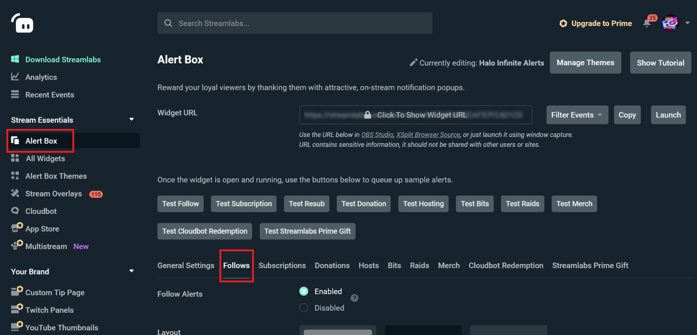
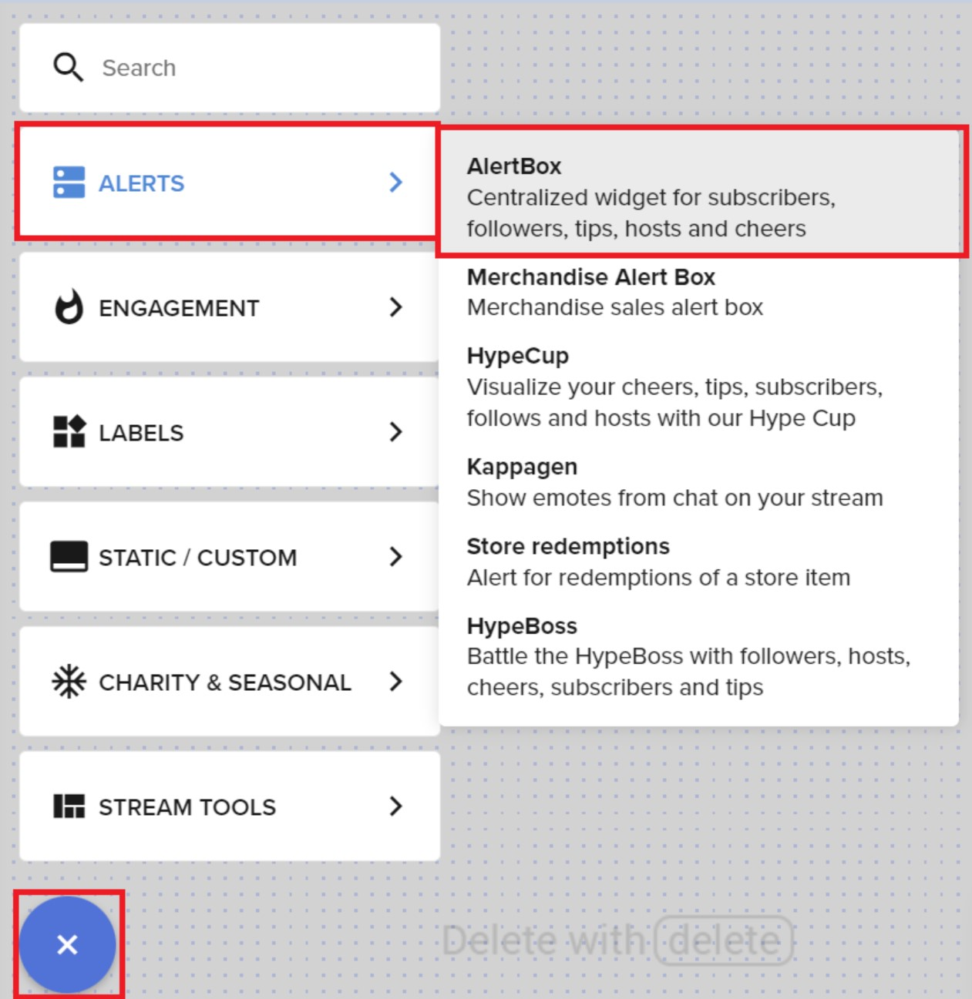

<h1 align="center">Halo Infinite Stream Alert</h1>

  
  
  
   
  
  

A template for nice Halo Infinite themed alerts to use with Streamlabs.

## Table of Content

|                                           |
|-------------------------------------------|
| [Streamlabs Setup](#streamlabs)           |
| [StremElements Setup](#streamelements)    |
| [Available templates (3)](#variants)      |
| [Questions or suggestions?](#suggestions) |
|                                           |

---

## How to set it up on Streamlabs

1. Log in https://streamlabs.com/

2. In the left sidebar, click on "__Alert Box__" and in this section, select the type of alert you want to edit, for example "__Follows__":

3. Set the following parameters:
    * __Alert animation__: `Fade In` and `Fade Out`,
    * __Message template__: Whatever you'd like, for example `Thank you for following,` but *without the username*,
    * __Text animation__: `None`,
    * __Sound__: Upload the file `alert-sound.mp3` from this project,
    * __Alert duration__: `8s`,
    * __Alert text delay__: `0s`,
    * __Enable custom HTML/CSS__: `Enabled`.

4. Copy the content of `template-streamlabs.html` of this project and paste it into the __HTML__ field.

5. Copy the content of `template.css` of this project and paste it into the __CSS__ field.

| **Note** |
|-------------------------------------------|
| If you're setting up the "template-cheer" variant, copy the content of `template-cheer-streamlabs.js` and paste it into the __JS__ field |

6. Save settings.

And you're good to go!

---

## How to set it up on Streamelements

1. Log in https://streamelements.com/

2. In the left sidebar, under "__Streaming Tools__", click on "__My overlays__".

3. If you want to add this alert in an existing overlay, click on the "__Edit__" button on your overlay, otherwise click on "__Create a blank overlay__" and set it to 1080p.

4. In the editor tool, click on the **+** button (bottom left of the editor), then go to "Alerts" then "AlertBox":

5. Uncheck all the alerts you don't want to manage right now.

6. Click on the cog icon (⚙️) located at the right of the type of alert you want to manage.

7. Clear the video.

8. Click on "🎵 Upload sound" and upload the file `alert-sound.mp3` from this project.

9. Set "__Alert duration__" to 8.

10. Set "__Alert message__" to _"Thank you for following,"_ or whatever you'd like, but without the username.

11. Turn on the "__Enable custom CSS__" switch.

12. Click on "__Open CSS Editor__". 

13. In the editor modal, clear the content of every tab (HTML, CSS, JS, Fields (Data should be empty already)).

14. Under the "__HTML__" tab, paste the content of the file `template-streamelements.html` of this project.

15. Under the "__CSS__" tab, paste the content of the file `template.css` of this project.

16. Close these settings.

17. Go to "__Position, size and style__".

18. Set the `width` to **1920**, the `height` to **1080**, and make sure `top` and `left` are both to **0**.

19. Save settings (top right of the window).

And you're finally good to go!

---

### Available templates
### "Template"

### "Template B"

### "Template Cheer"

---

## Any question or suggestion?

Feel free to contact us on Discord: https://discord.gg/74UAq84 !

You can also message us on Twitter: https://twitter.com/HaloCreation
